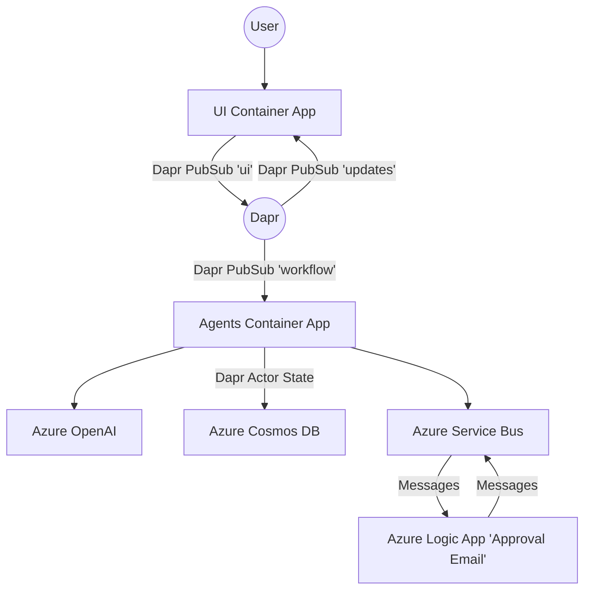

# Agents Escalation

This project is a Chainlit application that integrates with Dapr for pub/sub messaging to handle customer service escalations using AI agents. When the agents are unable to resolve an issue, it is escalated to a human agent via LogicApps sending an Approval email.

## Features

- **Chainlit Integration**: Provides a chat interface for user interactions.
- **Dapr Pub/Sub**: Subscribes to Dapr pub/sub to receive and handle messages.
- **AI Agents**: Uses [Vanilla AI agents](https://github.com/Azure-Samples/vanilla-aiagents) to process user inquiries and escalate issues when necessary.
- **Azure Integration**: Utilizes Azure OpenAI, Cosmos DB, and Service Bus.

## Architecture



1. A user interacts with the UI Container through a Chainlit chat.
1. The UI publishes user messages via Dapr to a PubSub (Azure ServiceBus topic), which is routed to the Agents Container (still via Dapr PubSub).
1. The Agents Container is FastAPI-based, listens to Dapr PubSub and uses Dapr Actors to manage state (via Azure CosmosDB).
1. If an issue needs human escalation, this will produce a message with `type = 'stop'` and `source = 'approver_user` which triggers the Logic App to send an email to the approver.
1. The Logic App then handles approval responses and communicates back to PubSub, and eventually to the Agents Container, which can publish “updates” back to the UI.

## Getting Started

### Prerequisites

- Python 3.12
- Azure Subscription
- Azure Developer CLI

### Installation

```sh
git clone https://github.com/Azure-Samples/agents-escalation.git
cd agents-escalation
azd up
```

After the deployment is complete, you will need to update the Office 365 connection:

1. Go to the Azure Portal and navigate to the resource group created by `azd up`.
2. Find the `office365` resource and click on it
3. Click on the "Edit connection" sidemenu item
4. Approve the connection (login to your Office 365 account) and hit "Save"

## Usage

- Get UI Container App URL from the output of `azd up`
- Open the URL in a web browser with `/chat`
- Start a chat with the bot asking `I want a refund for order #123`
- Insist to escalate the issue to a human agent
- Check your email for the approval request

## Contributing

This project welcomes contributions and suggestions. Please see [CONTRIBUTING.md](CONTRIBUTING.md) for details.

## License

This project is licensed under the MIT License. See [LICENSE.md](LICENSE.md) for details.

## Resources

- [Dapr Documentation](https://docs.dapr.io/)
- [Chainlit Documentation](https://docs.chainlit.io/)
- [Azure OpenAI Documentation](https://docs.microsoft.com/en-us/azure/cognitive-services/openai/)
